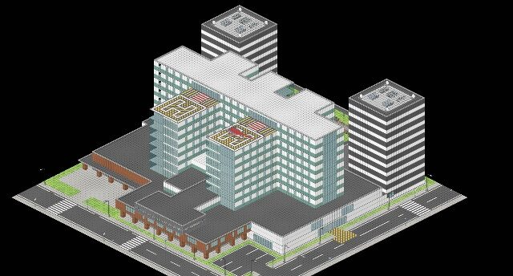
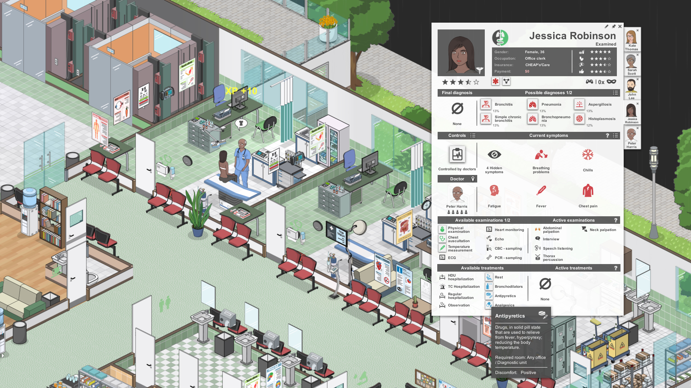

## 🚧 Current State and To-Do

The project is currently in the draft phase. Here's what we're working on:

- Setting up the world 🌍
- Setting the AI powered NPCs 🧑‍⚕️
- Setting the game flow 🎮

# 🩺 MedicalAGI: Revolutionizing Digital Healthcare through Diagnosis and Management 🚀

Welcome to the MedicalAGI repository! This project is currently in its draft phase. We aim to create a virtual hospital environment and medical software development framework using intelligent agents.

2D pixelart inspired by POKEMON

SCREENSHOTS FROM PROJECT HOSPITAL GAME

## 🏥 Project Overview

MedicalAGI operates through various intelligent agents, each holding specific roles within a multi-agent organizational structure. These roles include Triage Nurses, Nursing staff, Medical students, interns, residents, consultants, hospital administration, allied health staff, pharmaceutical staff, medical device staff, repair staff, security, Chief Executive Officer, Chief Product Officer, Chief Technology Officer, programmer, reviewer, tester, and art designer.

The primary mission of MedicalAGI is to revolutionize the digital healthcare landscape through advanced diagnosis and management. The intelligent agents collaborate through specialized functional seminars, covering tasks such as triaging, Outpatients, Inpatients, Diagnosis, Treatments, designing, coding, testing, and documenting.

INTERNAL MEDICINE OUTPATIENT CLINIC

INTERACTION INSPIRED BY CHATDEV

## 🎯 Objectives

- Provide an easy-to-use, highly customizable, and extendable framework of Fully Automated Hospital.
- Incorporate large language models (LLMs), 3D Healthcare Digital Twin and Computer Vision Models.
- Facilitate the study and creation of collective Medical intelligence.

## 📂 Project Structure

- **agents/**: Contains subdirectories for each intelligent agent role.
- **code/**: Holds the codebase, organized by functionalities and roles.
- **documentation/**: Stores project documentation, guidelines, and resources.
- **resources/**: Additional assets, datasets, or materials used by the project.

## 📂 Project Components

- **Internal Medicine/**: Contains subdirectories for each intelligent agent role.
- **General Surgery/**: Holds the codebase, organized by functionalities and roles.
- **Emergency Medicine/**: Stores project documentation, guidelines, and resources.
- **Orthopedics/**: Additional assets, datasets, or materials used by the project.
- **Cardiology/**: Contains subdirectories for each intelligent agent role.
- **Neurology/**: Holds the codebase, organized by functionalities and roles.
- **GastroEnterology/**: Holds the codebase, organized by functionalities and roles.
- **Hepatology/**: Holds the codebase, organized by functionalities and roles.
- **Haematology/**: Holds the codebase, organized by functionalities and roles.
- **Pediatrics/**: Stores project documentation, guidelines, and resources.
- **Ophthalmology/**: Additional assets, datasets, or materials used by the project.
- **ENT/**: Contains subdirectories for each intelligent agent role.
- **PSM/**: Holds the codebase, organized by functionalities and roles.
- **Epidemiology/**: Stores project documentation, guidelines, and resources.
- **Psychiatry/**: Additional assets, datasets, or materials used by the project.
- **Obstetrics/**: Additional assets, datasets, or materials used by the project.
- **Gynecology/**: Contains subdirectories for each intelligent agent role.
- **Sexual Health/**: Holds the codebase, organized by functionalities and roles.
- **Plastic Surgery/**: Stores project documentation, guidelines, and resources.
- **Oncology/**: Contains subdirectories for each intelligent agent role.
- **Nephrology/**: Contains subdirectories for each intelligent agent role.
- **Urology/**: Contains subdirectories for each intelligent agent role.
- **Pathology/**: Additional assets, datasets, or materials used by the project.
- **Forensic Medicine/**: Contains subdirectories for each intelligent agent role.
- **Microbiology/**: Additional assets, datasets, or materials used by the project.
- **Anesthesiology/**: Additional assets, datasets, or materials used by the project.
- **Radiology/**: Contains subdirectories for each intelligent agent role.
- **Genetics/**: Additional assets, datasets, or materials used by the project.
- **Biostatistics/**: Additional assets, datasets, or materials used by the project.
- **Nursing Department/**: Additional assets, datasets, or materials used by the project.
- **Critical Care Medicine/**: Contains subdirectories for each intelligent agent role.
- **Infectious Disease/**: Contains subdirectories for each intelligent agent role.
- **Traumatology/**: Contains subdirectories for each intelligent agent role.
- **Geriatrics/**: Holds the codebase, organized by functionalities and roles.
- **Anatomy/**: Contains subdirectories for each intelligent agent role.
- **Physiology/**: Contains subdirectories for each intelligent agent role.
- **Biochemistry/**: Contains subdirectories for each intelligent agent role.
- **Pharmacology/**: Contains subdirectories for each intelligent agent role.
- **Electronic Health Records/**: Contains subdirectories for each Records, Medical Coding, Disease Classification, Medical Ontology-Concepts.
- **Architecture and Health Design/**: Contains subdirectories for each intelligent agent role.
- **Medical Device/**: Holds the codebase, organized by functionalities and roles.
- **Paramedical Department/**: Holds the codebase, organized by functionalities and roles.
- **Housekeeping and Sterilization/**: Holds the codebase, organized by functionalities and roles.
- **Nutrition- Dietitics/**: Holds the codebase, organized by functionalities and roles.
- **Biomedical Engineering/**: Holds the codebase, organized by functionalities and roles.
- **Healthcare IT/**: Holds the codebase, organized by functionalities and roles.
- **Healthcare Economics/**: Holds the codebase, organized by functionalities and roles.
- **Hospital Administration/**: Holds the codebase, organized by functionalities and roles.
- **Research and Development/**: Holds the codebase, organized by functionalities and roles.
- **Big Journal/**: Holds the codebase, organized by functionalities and roles
- **FDA/**: Holds the codebase organized by funcitonalities and roles
- **Big Pharma/**: Holds the codebase, organized by functionalities and roles.
- **Self Driving Ambulance/**: Holds the codebase, organized by functionalities and roles.
- **Self Flying Air Ambulance/**: Holds the codebase, organized by functionalities and roles.
- **Screen UX-UI Automation/**: Holds the codebase, organized by functionalities and roles.

## Project outcome
- Its made to surface the underlying meta-language of medicine and healthcare through concept building the unchartered language of biosemiotics especially in humans. 
- Automation of every aspect of healthcare to precipitate new knowledge, concept and cures through ongoing recursive reiteration of software on real world patients and humans
- The surface knowledge generating software is meant to be run parallely in many servers across the world connected to each other through cloud- to complete the human medical knowledge
- This completed medical knowledge can be used to cure mortality

## 🚀 Getting Started

If you want to contribute or try out the MedicalAGI framework, follow the steps in the [Contribution.md](Contribution.md) file.

## 🤝 How to Contribute

We welcome contributions from the community! Check out the [Contribution.md](Contribution.md) file for guidelines on how to contribute to the project.

## 📜 License

This project is licensed under the [Your License Name](LICENSE) - see the [LICENSE](LICENSE) file for details.

## 📚 Code of Conduct

Please read our [Code of Conduct](CODE_OF_CONDUCT.md) to understand the expectations for participating in this project.

## Contact

For questions or discussions, feel free to reach out to [Your Contact Information].

Happy coding!

